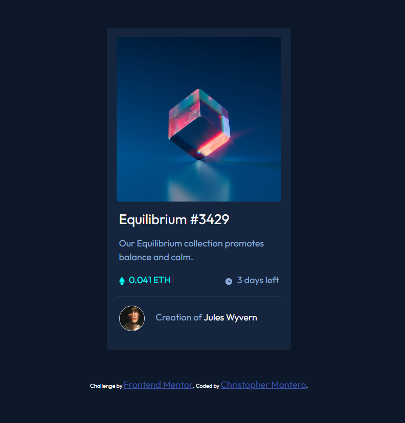

# Frontend Mentor - NFT preview card component solution

This is a solution to the [NFT preview card component challenge on Frontend Mentor](https://www.frontendmentor.io/challenges/nft-preview-card-component-SbdUL_w0U). Frontend Mentor challenges help you improve your coding skills by building realistic projects. 

## Table of contents

- [Overview](#overview)
  - [The challenge](#the-challenge)
  - [Screenshot](#screenshot)
  - [Links](#links)
  - [Built with](#built-with)
  - [Author](#author)

## Overview

### The challenge

Users should be able to:

- View the optimal layout depending on their device's screen size
- See hover states for interactive elements

### Screenshot

### Links

- Solution URL: [Add solution URL here](https://your-solution-url.com)
- Live Site URL: [Add live site URL here](https://your-live-site-url.com)

##  Built with 🔨

- Semantic HTML5 markup
- CSS custom properties
- Flexbox
- CSS Grid
- Mobile-first workflow
- [Bootstrap](https://getbootstrap.com/) - UI Framework
- [Google Fonts](https://fonts.google.com/) - Typography

## Author 🧑🏽‍💻✌️

- GitHub - [christopherjael](https://github.com/christopherjael)
- Website - [Christopher](https://christopherjael.github.io/)
- Frontend Mentor - [@christopherjael](https://www.frontendmentor.io/profile/christopherjael)
